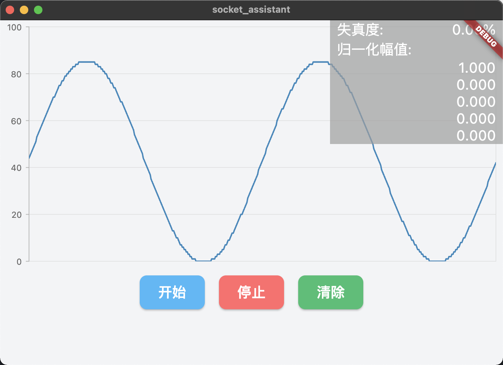

# socket_assistant

使用 Flutter 和 esp8266 通过 socket 进行通信，传递角度数据。

本项目已帮助两队获得2021年全国大学生电子设计竞赛国奖

## 页面 UI



## 模拟服务端

```python
import socket
import time
import random
import json
from typing import List
import numpy as np
x = np.linspace(0, 4*np.pi, 480)  # 4/2=2 2个完整的正弦波波形   4*8代表一共生成的点数量
y = 43+43*np.sin(x)  # 调整43这个值可以调整波峰值
y1: List[int] = list(y.astype(int))  # 把y值转换成整数
s = socket.socket(socket.AF_INET, socket.SOCK_STREAM)
s.setsockopt(socket.SOL_SOCKET, socket.SO_REUSEADDR, 1)
host = '0.0.0.0'
port = 8888
s.bind((host, port))

s.listen(5)
while True:
    c, addr = s.accept()
    print('连接地址：', addr)
    for i in range(len(y1)):
        try:
            jsonStr = str(json.dumps({'x': i, 'y': int(y1[i])}))
            jsonStr = jsonStr.replace(' ', '') + ' '
            print(jsonStr)
            c.send(jsonStr.encode())
        except:
            import traceback
            import sys
            traceback.print_exc()  # 打印异常信息

            exc_type, exc_value, exc_traceback = sys.exc_info()
            error = str(repr(traceback.format_exception(exc_type, exc_value, exc_traceback)))  # 将异常信息转为字符串

            print(error)
            break
    c.close()
```
