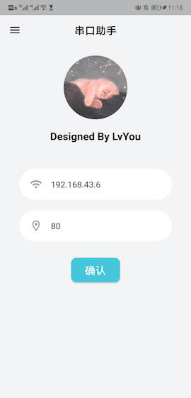

# socket_assistant

使用Flutter和esp8266通过socket进行通信，传递角度数据。

## 页面UI



## 模拟服务端

```python
import socket
import time
import random

s = socket.socket(socket.AF_INET, socket.SOCK_STREAM)
s.setsockopt(socket.SOL_SOCKET, socket.SO_REUSEADDR, 1)
host = '0.0.0.0'
port = 8888
s.bind((host, port))

s.listen(5)
while True:
    c, addr = s.accept()
    print('连接地址：', addr)
    for i in range(100):
        angle = random.uniform(0, 360)
        print(angle)
        try:
            c.send('{:.1f}'.format(angle).encode())
        except:
            print('error')
            break
        time.sleep(0.25)
    c.close()
```
